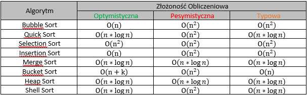

# Algorytmy i Struktury Danych

## Algorytmy sortujące
**Podsumowanie**

### Bubble Sort
**1. Pierwsza iteracja**
1. Zaczynając od pierwszego indeksu, porównujemy pierwszy i drugi element.
2. Jeśli element pierwszy jest większy niż drugi, to zamieniamy je ze sobą
3. Porównujemy drugi i trzeci element
4. Zamieniamy jeśli drugi jest większy od trzeciego
5. Całość powtarzamy aż do ostatniego elementu

**2. Pozostałe iteracje**

Taki sam proces powtarzamy dla pozostałych iteracji.
Na koniec każdej iteracji, największy element spośród nieposortowanych elementów, umieszczany jest na końcu

W każdej iteracji porównywanie odbywa się do ostatniego nieposortowanego elementu

Tablica jest posortowana, gdy wszystkie nieposortowane elementy znajdą sie na swoich pozycjach

