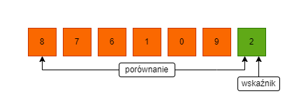

# Algorytmy i Struktury Danych

## Algorytmy sortujące
**Podsumowanie**

### Bubble Sort
**1. Pierwsza iteracja**
1. Zaczynając od pierwszego indeksu, porównujemy pierwszy i drugi element.
2. Jeśli element pierwszy jest większy niż drugi, to zamieniamy je ze sobą
3. Porównujemy drugi i trzeci element
4. Zamieniamy jeśli drugi jest większy od trzeciego
5. Całość powtarzamy aż do ostatniego elementu

**2. Pozostałe iteracje**

Taki sam proces powtarzamy dla pozostałych iteracji.
Na koniec każdej iteracji, największy element spośród nieposortowanych elementów, umieszczany jest na końcu

W każdej iteracji porównywanie odbywa się do ostatniego nieposortowanego elementu

Tablica jest posortowana, gdy wszystkie nieposortowane elementy znajdą sie na swoich pozycjach

### Quicksort
**1. Wybranie Pivota**
Istnieją różne rodzaje podejść do wybrania pivota. Tutaj będzie nim element najbardziej z prawej.

**Przekształcenie tablicy**
Teraz elementy tablicy są uporządkowane w ten sposób, że elementy mniejsze od pivota są umieszczane po lewej jego stronie, a elementy większe po prawej.

Przekształcenie tablicy przebiega w następujący sposób:
1. Wskaźnik jest umieszczony na pivocie. Pivot jest porównywany z pozostałymi elementami, zaczynając od pierwszego.

2. Jeśli element est większy od pivota to ustawiany jest na nim drugi wskaźnik

3. Teraz pivot jest porównywany z pozostałymi elementami. Jeśli znaleziono element mniejszy od pivota to zamieniany jest on z wcześniej znalezionym większym elementem.

4. Proces jest powtarzany (kolejny większy od pivota element jest zamieniany z kolejnym mniejszym)

5. Proces jest kontynuowany aż do momentu osiągnięcia drugiego elementu od końca.

6. Pivot jest zamieniany z drugim wskaźnikiem.

**3. Podział na podtablice**
Pivot jest ponownie wybierany, osobno dla lewej i prawej części. Powtarza się krok drugi.

Poddtablice są dzielone, aż każda z nich będzie utworzona z jednego elementu. W tym momencie tablica jest już posortowana.